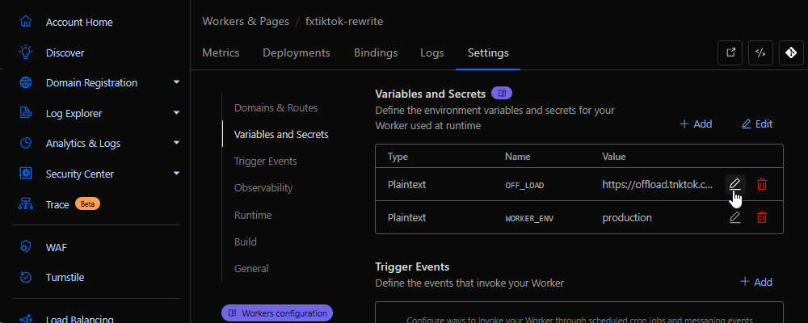

# fxTikTok

Embed TikTok videos and slideshows on Discord with just `s/i/n`

## 📸 Screenshots

<details>
  <summary>Click here to preview how fxTikTok looks in action</summary>

|  |
| :-----------------------------------------------------------------------------------------------------------------------------------: |
|                                       Comparing `tiktok.com` vs. `tnktok.com` embeds on Discord                                       |

|  |
| :--------------------------------------------------------------------------------------------------------------------------: |
|                                                       Slideshow embeds                                                       |

|  |
| :----------------------------------------------------------------------------------------------------------------: |
|                                                 Live video embeds                                                  |

|  |
| :-----------------------------------------------------------------------------------------------------------------------------------: |
|                                                      Direct image/video support                                                       |

</details>

## 📖 Usage

Using fxTikTok is easy on Discord. Fix ugly and unresponsive embeds by sending your TikTok link and then typing `s/i/n`

<details>
  <summary>👁️ Visual learner? Click here to see a GIF tutorial</summary>

  
</details>

### How does this work?

When you send `s/i/n` in Discord, it modifies your most recent message using the [sed](https://www.gnu.org/software/sed/manual/sed.html) format. Specifically, it replaces the first occurrence of the second parameter (`i`) in the message with the third parameter (`n`).

|     Before     |     After      |
| :------------: | :------------: |
| t**i**ktok.com | t**n**ktok.com |

### Using Direct Embeds

Don't want all that statistic clutter on your embed and only want the video or image? Simply change your URL to `d.tnktok.com`

|         Before         |        After         |
| :--------------------: | :------------------: |
| **www**.t**i**ktok.com | **d**.t**n**ktok.com |

> Alternatively, you can also set `isDirect` to true thru the URL query by adding `?isDirect=true` at the end of your URL

### "I don't see the video's caption!"

By default, we put the description into the `og:description` tag, but Discord removes that from the embed if there's a video inside the embed. We decided not to add it to the top like what [tfxktok.com](https://tfxktok.com) does to prevent the embed from getting too cluttered with hashtags.

However, we want to give users the option to add it in case it brings additional context to the video. You can change your URL to `a.tnktok.com` to add the description to the top.

|         Before         |        After         |
| :--------------------: | :------------------: |
| **www**.t**i**ktok.com | **a**.t**n**ktok.com |

> Alternatively, you can also set `addDesc` to true thru the URL query by adding `?addDesc=true` at the end of your URL

### Changing to High Quality

TikTok supports H.265/HEVC (High Efficiency Video Coding) which offers significantly better quality at the same file size compared to H.264, at the cost of compatibility. By default, we use H.264 quality since [many users report issues with embeds breaking with H.265](https://github.com/okdargy/fxTikTok/issues/14), but support enabling H.265.

To enable high quality H.265 playback, add `?hq=true` or use `hq.tnktok.com`:
| Before | After |
| :--------------------: | :------------------: |
| **www**.t**i**ktok.com | **hq**.t**n**ktok.com |

### Combining Modes

You can combine different modes by using specific hostnames or URL query parameters. For example, if you want to enable H.265 and also see the caption, you can use `hq.a.tnktok.com` or add `?hq=true&addDesc=true` to the URL.

> You cannot use Direct Mode and Caption Mode simultaneously since they contradict themselves.

### Why use tnktok.com?

We check all the boxes for being one of the best TikTok embedding services with many features that others don't have. Here's a table comparing our service, tnktok.com, with the other TikTok embedding services as well as TikTok's default embeds.

|                                        | [tnktok.com](https://www.tnktok.com) | Default TikTok | [tiktxk.com](https://tiktxk.com) | [vxtiktok.com](https://vxtiktok.com) | [tfxktok.com](https://tfxktok.com) |
| -------------------------------------- | ------------------------------------ | -------------- | -------------------------------- | ------------------------------------ | ---------------------------------- |
| Embed playable videos                  | ☑️                                   | ☑️             | ❔                               | ☑️                                   | ☑️                                 |
| Embed multi-image slideshows           | ☑️                                   | ❌             | ❔                               | ❌                                   | ☑️                                 |
| Embed lives                            | ☑️                                   | ➖             | ❌                               | ❌                                   | ☑️                                 |
| Open source                            | ☑️                                   | ❌             | ☑️                               | ☑️                                   | ❌                                 |
| Supports direct embeds                 | ☑️                                   | ❌             | ❌                               | ❌                                   | ❌                                 |
| Shows like, shares, comments           | ☑️                                   | ☑️             | ➖                               | ☑️                                   | ☑️                                 |
| Removes tracking for redirects         | ☑️                                   | ❌             | ☑️                               | ☑️                                   | ☑️                                 |
| Support for multi-continent short URLs | ☑️                                   | ☑️             | ☑️                               | ☑️                                   | ❌                                 |
| Support for h265/high quality          | ☑️                                   | ❌             | ❔                               | ❌                                   | ❌                                 |
| Last commit                            | [![][tnk]][tnkc]                     | N/A            | [![][txk]][txkc]                 | [![][vxt]][vxtc]                     | N/A                                |

[tnk]: https://img.shields.io/github/last-commit/okdargy/fxTikTok?label
[tnkc]: https://github.com/okdargy/fxTikTok/commits
[txk]: https://img.shields.io/github/last-commit/Britmoji/tiktxk?label
[txkc]: https://github.com/Britmoji/tiktxk/commits
[vxt]: https://img.shields.io/github/last-commit/dylanpdx/vxtiktok?label
[vxtc]: https://github.com/dylanpdx/vxtiktok/commits

### 💻 Selfhosting

By default, when setting up a new fxTikTok instance, the default offload server is `offload.tnktok.com`.
To setup your own, just compile and run [`offload.ts`](https://github.com/okdargy/fxTikTok/blob/hono-rewrite/src/offload.ts) which will start on port **8787**.

```bash
# Install all necessary dependencies
pnpm install
# Start your server
bun run src/offload.ts
```
> I recommend configuring this to your own domain alongside a reverse proxy like [nginx](https://nginx.org) and on top of Cloudflare with protection on.

Next, deploy your Worker with the button below and follow the instructions.

[](https://deploy.workers.cloudflare.com/?url=https://github.com/okdargy/fxtiktok)

Once done, go to "Settings" and change your offload server under "Variables and Secrets":



#### 🎉 That's it! You now have your own fxTikTok instance to use whenever, wherever you like.